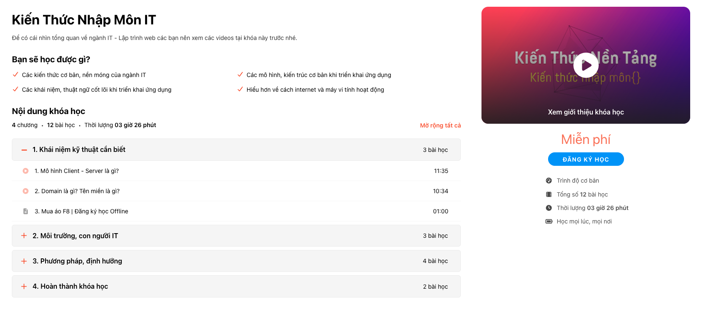

1. Đây là trang web học tập. Sẽ phân biệt ra giáo viên và người học.
2. Khi đăng ký người dùng(giáo viên và người học) sẽ phải phân biệt ra khi vào trang dashboard.
3. Khi đăng ký xong và người dùng thực hiện đăng nhập. Thì nếu là giáo viên người dùng phải xác thực cách đăng bằng chứng: cccd mặt trước và sau, bằng chứng là giáo viên. Và đợi admin duyệt thì teacher mới thao tác được các chức năng của mình.
4. Với chức năng của teacher (Bạn có thể kết hợp đọc file db.md (/Users/phong_mac/Documents/Code/Next js/E-Learning/elearning-frontend/docs/db.md) để hiểu rõ hơn các phần).
  - Tạo bài giảng (bảng courses). 
    + Sẽ cho nhập tiêu đề bài giảng ví dụ như là Toán hình học không gian. Mô tả khoá học: Toán hình học lớp 11 bổ sung nhiều kiến thức...Ảnh bải giảng. Cho upload file. Chọn subject: có list subject như là Toán, Tiếng Anh, Văn,... tôi chọn Toán (Mục đích để chọn xem đang là môn gì ). (Tôi sẽ mô tả qua qua). Nếu trong db thiếu trường gì bạn hãy bổ sung
    + Mỗi bài giảng sẽ chia thành các chương và mỗi chương sẽ có các bài học.
    + Bạn hãy tạo giao diện để giáo viên có thể tạo được add được các thông tin cần thiết vào. Ví dụ khi add chương (bảng chapters) thì sẽ có thể thêm tiêu đề, thứ tự order của chương đấy.
    + Mỗi chương sẽ có các bài giảng(bảng episodes). Tiêu đề, loại gì video hoặc quizz tuỳ giáo viên muốn. Thường sẽ là kiểu trong 1 chương đấy nếu xong các bài giảng thì sẽ cho người dùng làm quizz để ôn lại kiến thức. Bạn sẽ thiết kế giao diện hết cho tôi
  - Tạo bài kiểm tra.
    + Giáo viên có thể tạo bài kiếm tra Cho tất cả những ai tham gia kiểm tra. Sẽ có thời gian bắt đầu làm. Thời gian làm. Đếm ngược trước khi vào làm. 

5. Giao diện của teacher sau khi duyệt xong sẽ vào được trang riêng của giáo viên bạn hãy tự đặt tên. Bên trái sẽ có các nôi dung như là Thay đổi thông tin, Tạo khoá học. Tạo bài kiểm tra. Ví dụ khi bấm vào bài kiểm tra thì nó phải ra list bài kiểm tra đã tạo đang tạo,.. Bấm vào Tạo khoá học thì có list khóa học.Bấm vào 1 khoá học ra chi tiết khoá học. Tất cả làm thêm sửa xoá cho tôi.
6. Phần bài kiểm tra đã kết thúc sẽ có thể tổng được bảng xếp hạng điểm những user đã tham gia và điểm của họ, thời gian làm bài. Số người tham gia Tuỳ bạn thiết kế cho đầy đủ.
7. Với chức năng của học sinh (tạo page cho học sinh riêng)
  - Tìm giảng viên, khoá học. Hãy làm page search giảng viên và khoá học.
  - Bấm vào giảng viên cần tìm thì ra được cài bài giảng của giảng viên đó và bài kiểm tra sắp tới của giảng viên đó
  - Học bài giảng: Thiết kế giao diện tương tự trong ảnh cho tôi 
  - Xem các khoá đang học và tiếng trình học như trong ảnh

Vì là chưa có API nên bạn phải thiết kế tất cả giao diện cho tôi. Fake dữ liệu vào. Nhưng hãy làm nó tương tác như thật để tôi có thể ghép API vào.

=> Lưu ý: Vì là trước mắt làm phần của giáo viên trước nên bạn cần làm đủ các mục CRUD tất cả bài giảng, chương, bài học. Bạn hãy làm mượt mà